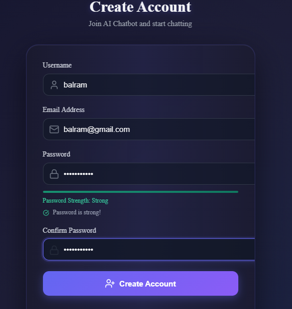
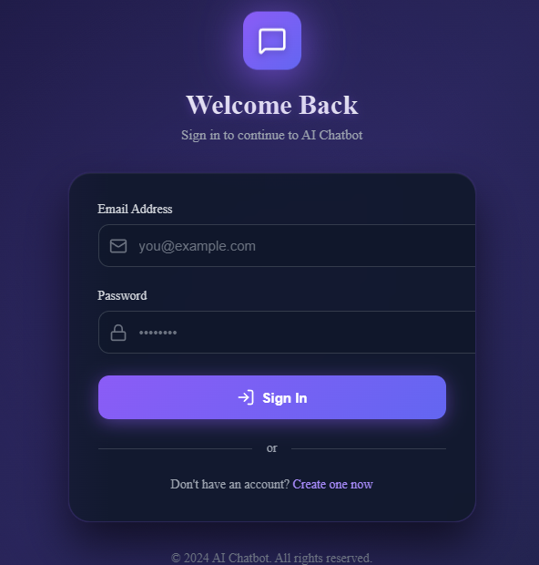
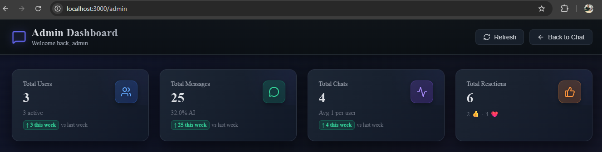
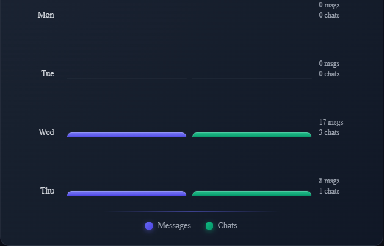
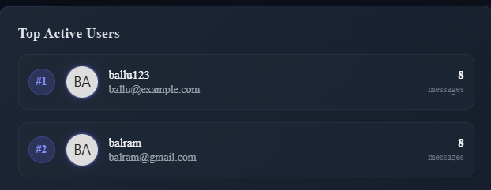

# AI-ChatBot 🤖

A full-stack AI-powered chatbot application with emotion detection, comprehensive user management, and powerful admin analytics dashboard.


## 📋 Table of Contents

- [Features](#features)
- [Screenshots](#screenshots)
- [Tech Stack](#tech-stack)
- [Installation](#installation)
- [Configuration](#configuration)
- [Usage](#usage)
- [Project Structure](#project-structure)
- [API Documentation](#api-documentation)
- [Contributing](#contributing)
- [License](#license)

## ✨ Features

### User Features
- **Authentication System**: Secure signup and login with JWT authentication
- **AI Chat Interface**: Intelligent conversational AI with real-time responses
- **Emotion Detection**: Advanced emotion recognition in user messages
- **Chat History**: Persistent conversation storage and retrieval
- **Responsive Design**: Seamless experience across all devices

### Admin Features
- **Comprehensive Dashboard**: Real-time overview of system metrics
- **User Management**: Complete CRUD operations for user accounts
- **Site Health Monitoring**: System performance and uptime tracking
- **Analytics & Insights**: Detailed usage statistics and trends
- **Top Users Tracking**: Identify most active users and engagement patterns
- **Database Monitoring**: Real-time database performance metrics
- **User Activity Logs**: Track and analyze user behavior patterns

## 📸 Screenshots

### User Interface

#### Signup Page

*Intuitive user registration with form validation*

#### Login Page

*Secure authentication interface*

#### Chat Interface

*Clean and modern chat interface with emotion detection*

### Admin Dashboard

#### Dashboard Overview

*Comprehensive admin control panel*

#### Health Monitoring

*Real-time system health metrics*

#### Analytics

*Detailed usage statistics and charts*

#### Top Users

*Most active users and engagement metrics*

#### User Activity

*Detailed user behavior tracking*

## 🛠️ Tech Stack

### Frontend
- **React** (v19.2.3) - UI library
- **React Router DOM** (v7.12.0) - Client-side routing
- **Axios** (v1.13.2) - HTTP client
- **Lucide React** (v0.562.0) - Icon library
- **Autoprefixer** (v10.4.23) - CSS post-processing
- **ESLint** - Code linting and formatting

### Backend
- **Node.js** with **Express** (v4.18.2) - Server framework
- **MongoDB** with **Mongoose** (v8.0.3) - Database
- **JWT** (jsonwebtoken v9.0.2) - Authentication
- **bcryptjs** (v2.4.3) - Password hashing
- **Express Validator** (v7.0.1) - Input validation
- **CORS** (v2.8.5) - Cross-origin resource sharing
- **dotenv** (v16.3.1) - Environment configuration
- **Nodemon** (v3.0.2) - Development server

## 🚀 Installation

### Prerequisites
- Node.js (v14 or higher)
- MongoDB (v4.4 or higher)
- npm or yarn

### Clone Repository
```bash
git clone https://github.com/yourusername/ai-chatbot.git
cd ai-chatbot
```

### Backend Setup
```bash
cd backend
npm install
```

Create a `.env` file in the backend directory:
```env
PORT=5000
MONGODB_URI=mongodb://localhost:27017/ai-chatbot
JWT_SECRET=your_jwt_secret_key_here
JWT_EXPIRE=7d
NODE_ENV=development
AI_API_KEY=your_ai_api_key_here
```

Start the backend server:
```bash
npm run dev
```

### Frontend Setup
```bash
cd frontend
npm install
```

Create a `.env` file in the frontend directory:
```env
REACT_APP_API_URL=http://localhost:5000/api
```

Start the frontend application:
```bash
npm start
```

## ⚙️ Configuration

### Environment Variables

#### Backend
| Variable | Description | Required |
|----------|-------------|----------|
| `PORT` | Server port number | Yes |
| `MONGODB_URI` | MongoDB connection string | Yes |
| `JWT_SECRET` | Secret key for JWT tokens | Yes |
| `JWT_EXPIRE` | Token expiration time | Yes |
| `AI_API_KEY` | API key for AI service | Yes |
| `NODE_ENV` | Environment mode | No |

#### Frontend
| Variable | Description | Required |
|----------|-------------|----------|
| `REACT_APP_API_URL` | Backend API URL | Yes |

## 📖 Usage

### For Users

1. **Register**: Create a new account on the signup page
2. **Login**: Access your account with credentials
3. **Chat**: Start conversing with the AI chatbot
4. **View History**: Access previous conversations anytime
5. **Emotion Insights**: See detected emotions in your messages

### For Admins

1. **Login**: Access admin panel with admin credentials
2. **Dashboard**: View system overview and key metrics
3. **Manage Users**: Create, update, or delete user accounts
4. **Monitor Health**: Track system performance and uptime
5. **Analyze Data**: Review analytics and user engagement
6. **Track Activity**: Monitor user behavior and patterns

## 📁 Project Structure

```
ai-chatbot/
├── frontend/
│   ├── public/
│   ├── src/
│   │   ├── components/
│   │   ├── pages/
│   │   ├── services/
│   │   ├── utils/
│   │   └── App.js
│   └── package.json
├── backend/
│   ├── config/
│   ├── controllers/
│   ├── models/
│   ├── routes/
│   ├── middleware/
│   ├── utils/
│   └── server.js
└── README.md
```

## 🔌 API Documentation

### Authentication Endpoints
- `POST /api/auth/signup` - Register new user
- `POST /api/auth/login` - User login
- `GET /api/auth/me` - Get current user

### Chat Endpoints
- `POST /api/chat/message` - Send message to AI
- `GET /api/chat/history` - Get chat history
- `DELETE /api/chat/history/:id` - Delete conversation

### Admin Endpoints
- `GET /api/admin/users` - Get all users
- `PUT /api/admin/users/:id` - Update user
- `DELETE /api/admin/users/:id` - Delete user
- `GET /api/admin/analytics` - Get analytics data
- `GET /api/admin/health` - Get system health metrics

## 🤝 Contributing

Contributions are welcome! Please follow these steps:

1. Fork the repository
2. Create a feature branch (`git checkout -b feature/AmazingFeature`)
3. Commit your changes (`git commit -m 'Add some AmazingFeature'`)
4. Push to the branch (`git push origin feature/AmazingFeature`)
5. Open a Pull Request

## 📝 License

This project is licensed under the MIT License - see the [LICENSE](LICENSE) file for details.

## 👥 Authors

- Your Name - [GitHub BalramApply](https://github.com/BalramApply)

## 🙏 Acknowledgments

- OpenAI for AI capabilities
- React community for excellent documentation
- MongoDB team for robust database solution
- All contributors who helped improve this project

## 📧 Contact

For questions or support, please contact:
- Email: balramapply@gmail.com
- GitHub: [@balramapply](https://github.com/BalramApply)
- LinkedIn: [balram](https://linkedin.com/in/Balram)

---

⭐️ If you find this project helpful, please consider giving it a star!

**Made with ❤️ by [Balram Patel]**
